# Calcul d'intégral + plus représentation graphique

Un programme SDL(Nécessite l'installation de SDL pour être compilé et exécuté voir ci-dessous) en langage c 

  <a href="https://raw.githubusercontent.com/vertingo/Calcul_Graphique_Integral/master/images/image_menu_poisson.png">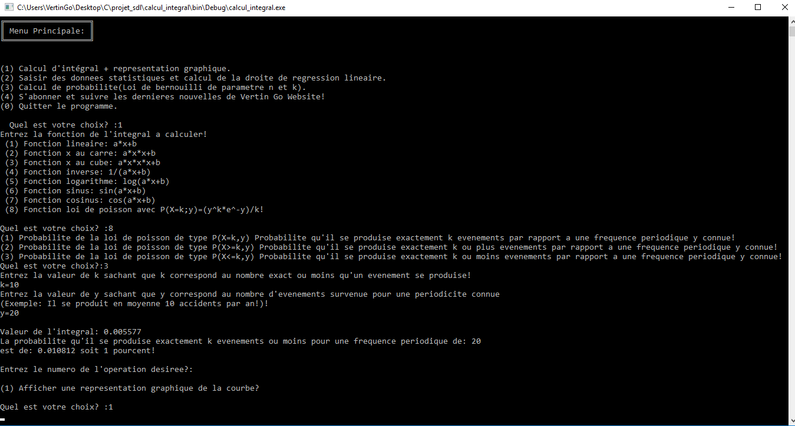</a>
   
  Représentation graphique de la loi de poisson sur [0,10] et [0,13]!
 <table>
  <td>
  <a href="https://raw.githubusercontent.com/vertingo/Calcul_Graphique_Integral/master/images/image_courbe_7.png">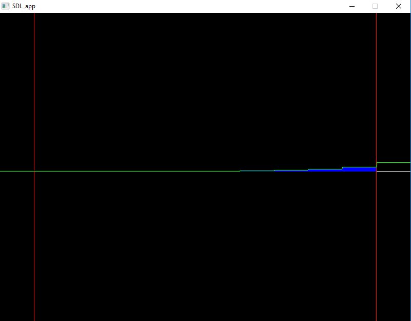</a>
  </td>
  <td>
  <a href="https://raw.githubusercontent.com/vertingo/Calcul_Graphique_Integral/master/images/image_courbe_8.png">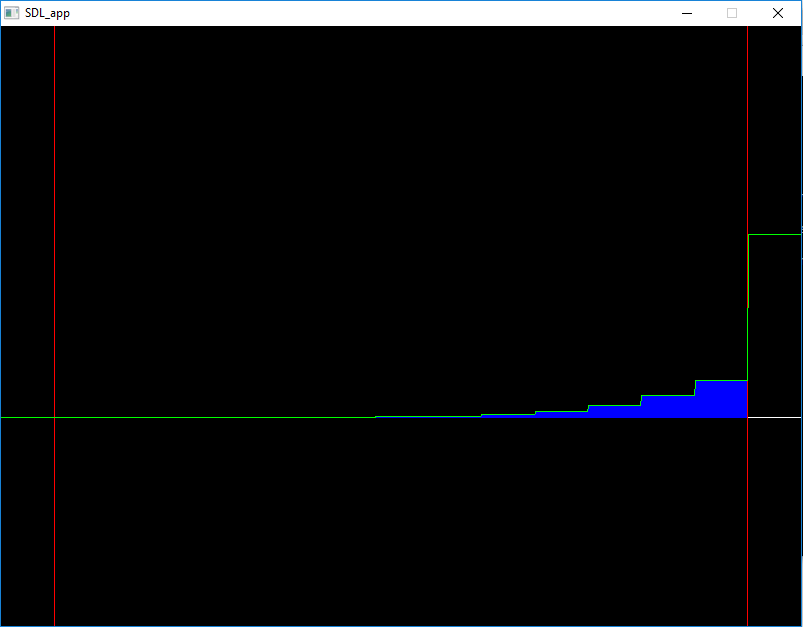</a>
  </td>
  </table> 
  

## Prérequis
Téléchargement et installation du logiciel Code::Blocks disponible en téléchargement sur le lien suivant: http://www.commentcamarche.net/download/telecharger-34056352-code-blocks

1)Installation localement du compilateur MinGW disponible en téléchargement sur le lien suivant: https://sourceforge.net/projects/mingw-w64/

2) Cliquez sur install puis continue
3) Choisir mingw-developper-toolkit, mingw32-base, mingw32-gcc g++, msys-base comme sur
la capture ci-dessous:

  

4) Puis dans le menu « Installation » cliquez sur « Apply changes »
5) Les packages sont alors téléchargés
6) Quittez
7) Exécutez « C:\MinGW\msys\1.0\postinstall », aux questions posées, répondre
a. y (yes)
b. y (yes)
c. Donnez le chemin d’installation de mingw, c’est-à-dire à la racine du disque c: c:\mingw

  

d. validez avec la touche entrée

Installation de la bibliothèque SDL qui permet de créer des graphiques dans la console disponible sur le lien suivant: https://www.libsdl.org/
Ensuite en bas à droite accéder à l'onglet download!
Une fois téléchargé rendez-vous dans le dossier d'installation du logiciel Code::Blocks et suivez-les étapes illustrer ci-dessous!

   
  Dézippé le contenu du dossier SDL à la racine du dossier du logiciel Code::Blocks 
   
  Assurez-vous bien que le dossier include contient bien le dossier SDL 
  <a href="https://raw.githubusercontent.com/vertingo/Calcul_Graphique_Integral/master/images/install-sdl3.png">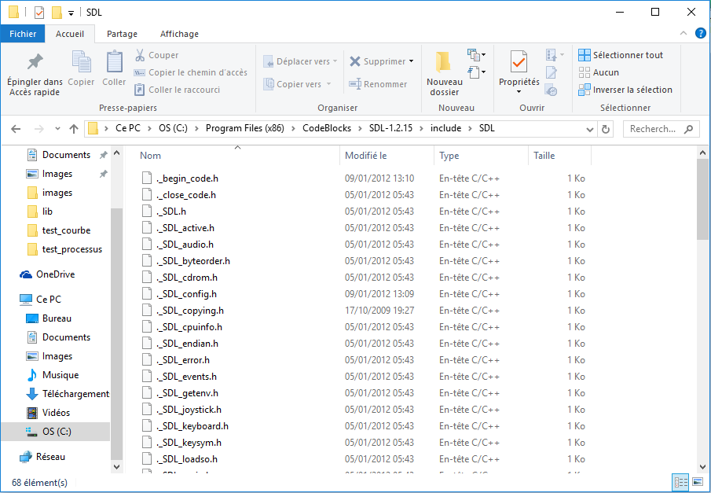</a> 

  <a href="https://raw.githubusercontent.com/vertingo/Calcul_Graphique_Integral/master/images/newproject-sdl.png">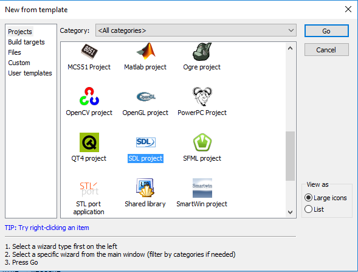</a> 
  Dans Code::Blocks faites file -> new project et choissisez un projet type SDL
   
  <a href="https://raw.githubusercontent.com/vertingo/Calcul_Graphique_Integral/master/images/newproject-sdl2.png">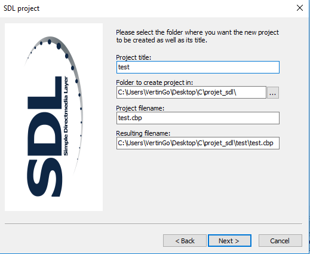</a> 
  <a href="https://raw.githubusercontent.com/vertingo/Calcul_Graphique_Integral/master/images/newproject-sdl3.png">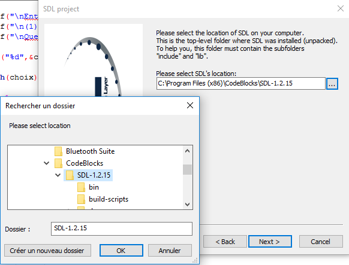</a> 
  Indiquez le chemin du dossier contenant le bibliothèque SDL normalement stocker  à la racine du dossier contenant le logiciel Code::Blocks! 
  <a href="https://raw.githubusercontent.com/vertingo/Calcul_Graphique_Integral/master/images/newproject-sdl4.png">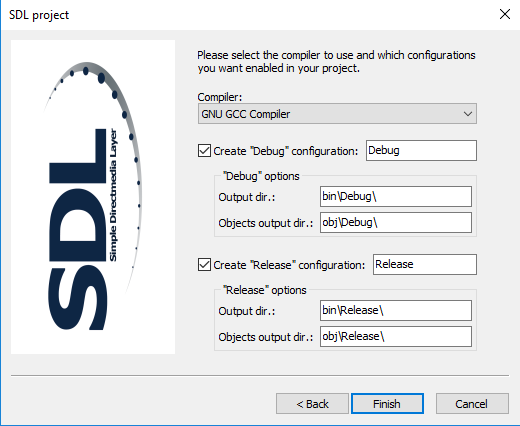</a> 

## Usage
Grâce à ce calculateur d'intégral vous allez pouvoir calculer l'intégral de n'importe quelle courbe en spécifiant la valeur des bornes inférieure et supérieure de l'intégral et également visualiser graphiquement l'air sous la courbe!
Voyez les illustrations ci-dessous!

  <a href="https://raw.githubusercontent.com/vertingo/Calcul_Graphique_Integral/master/images/image_menu_stats.png">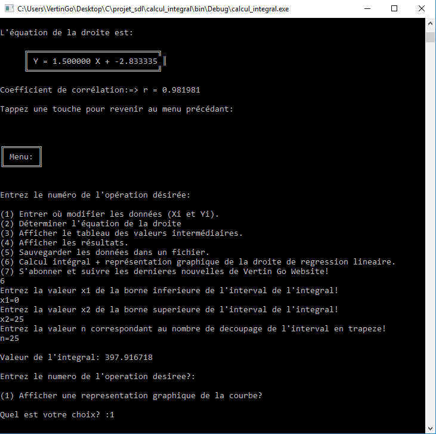</a>
   
  Représentation graphique de la droite de régréssion linéaire d'une série statistique!
  <table>
  <td>
  <a href="https://raw.githubusercontent.com/vertingo/Calcul_Graphique_Integral/master/images/image_courbe_stats.png">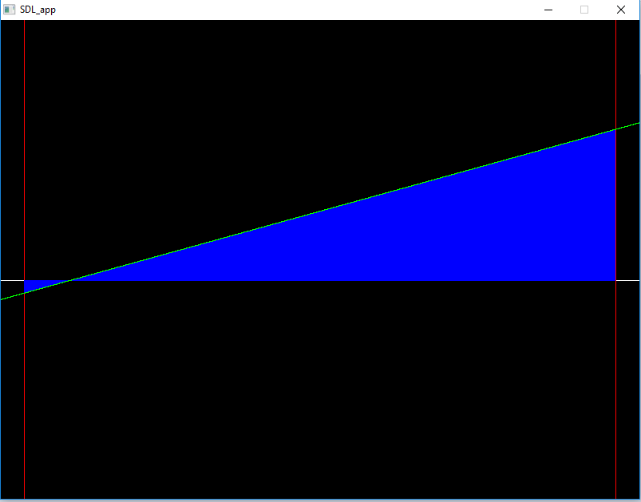</a>
  </td>
  </table>

  <a href="https://raw.githubusercontent.com/vertingo/Calcul_Graphique_Integral/master/images/image_menu_tengente.png">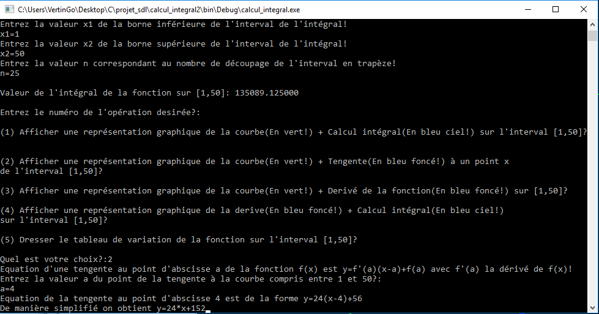</a>
   
  Représentation graphique d'une tengente avec sa droite d'équation de la forme y=f'(a)(x-a)+f(a)!
  <table>
   <td>
  <a href="https://raw.githubusercontent.com/vertingo/Calcul_Graphique_Integral/master/images/image_courbe8.png">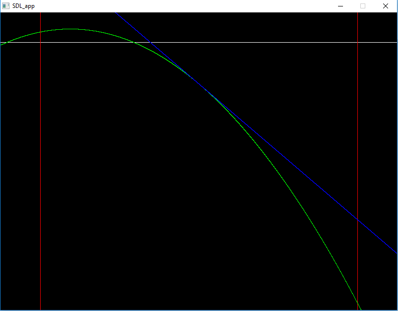</a>
  </td>
  </table>

  <a href="https://raw.githubusercontent.com/vertingo/Calcul_Graphique_Integral/master/images/image_menu_binome.png">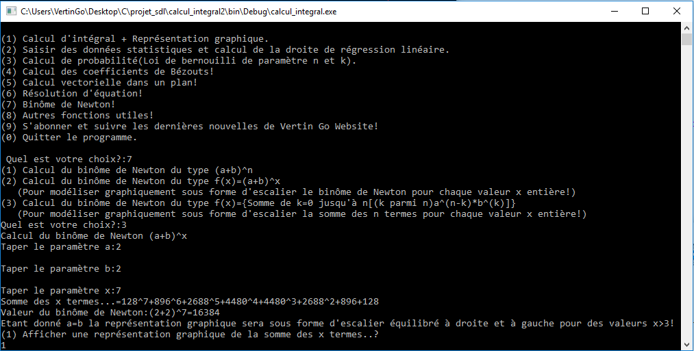</a>
   
  Représentation graphique de la formule du binôme de Newton tel que ∀ n ∈ N Hn:(a+b)^n=∑k=0 jusqu'à n(k parmi n)a^(n−k)*b^k! 
  On remarque: 
  Pour des choix de valeurs a>b ==> Escalier à droite! 
  Pour des choix de valeurs b>a ==> Escalier à gauche! 
  Pour des choix de valeurs a=b ==> Escalier équilibré à droite et à gauche! 
  <table>
  <td>
  
  </td>
      <td>
  <a href="https://raw.githubusercontent.com/vertingo/Calcul_Graphique_Integral/master/images/image_binome2.png">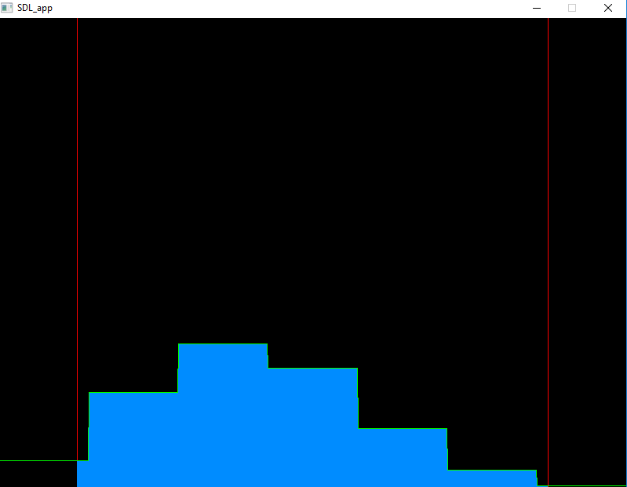</a>
  </td>
    <td>
  <a href="https://raw.githubusercontent.com/vertingo/Calcul_Graphique_Integral/master/images/image_binome3.png">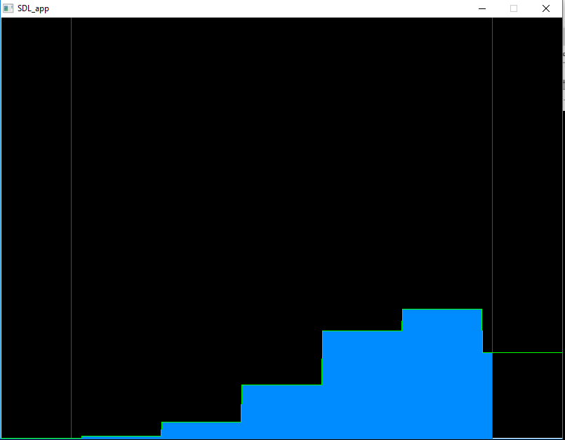</a>
  </td>
  </table>

  <a href="https://raw.githubusercontent.com/vertingo/Calcul_Graphique_Integral/master/images/image_menu_second_degree.png">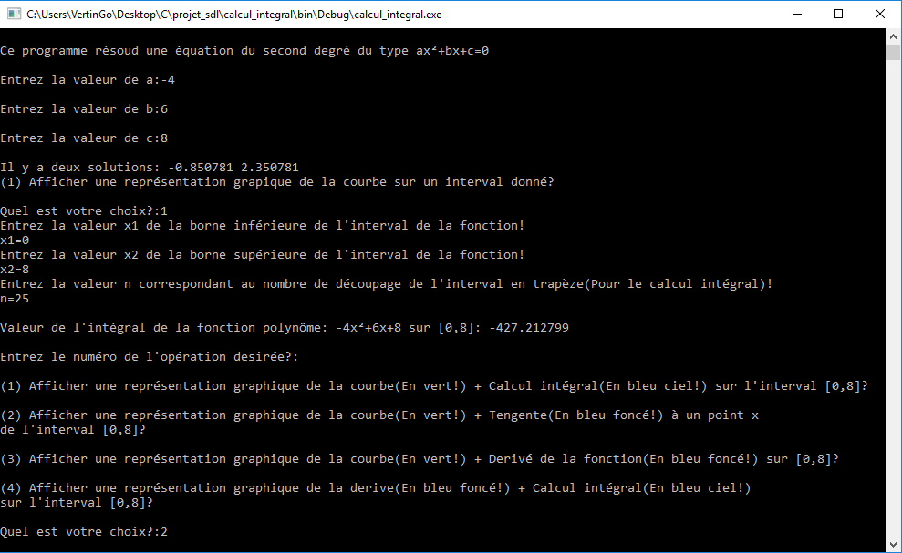</a>
   
  Représentation graphique d'un polynôme du second degré de la forme ax²+bx+c!
  
  <table>
  <td>
  <a href="https://raw.githubusercontent.com/vertingo/Calcul_Graphique_Integral/master/images/image_courbe7.png">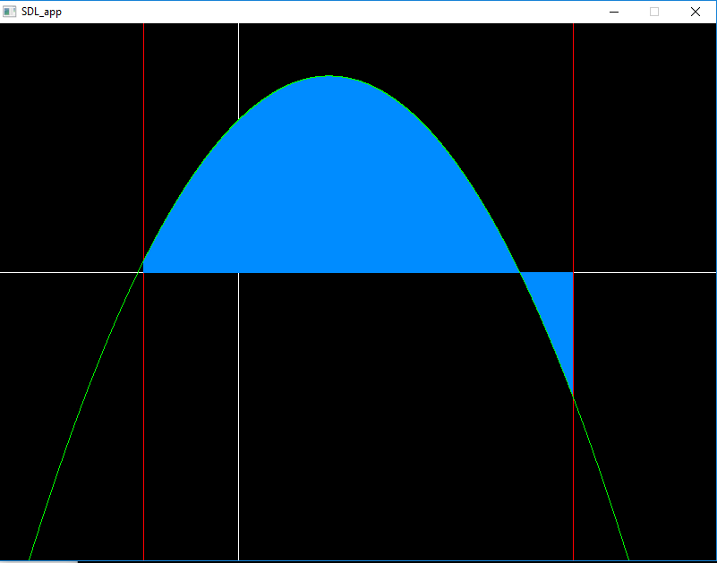</a>
  </td>
      <td>
  
  </td>
  <td valign='center'>
   
 Intégral de -3x²+4x+3 sur [0,15]= -2882.699951 
   <a href="https://raw.githubusercontent.com/vertingo/Calcul_Graphique_Integral/master/images/image_courbe9.png">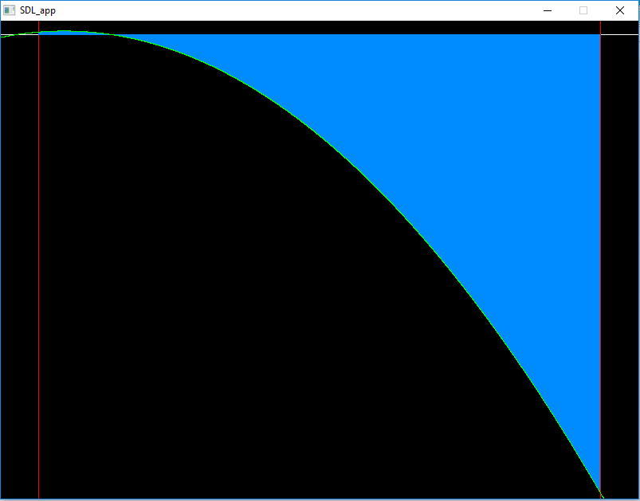</a>
   

  </td>
  </table>

  <a href="https://raw.githubusercontent.com/vertingo/Calcul_Graphique_Integral/master/images/image_menu_trajectoire.png">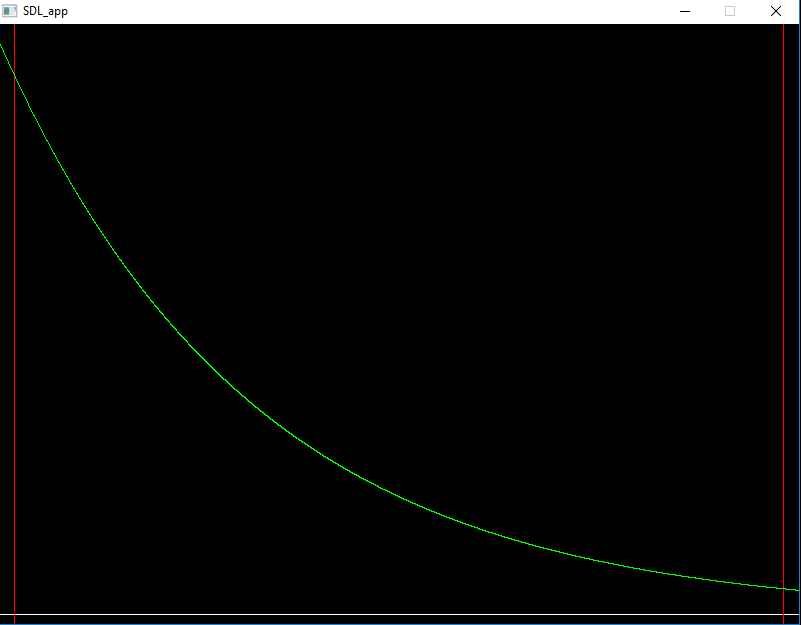</a>
   
  Calcul de la trajectoire d'un projectile + représentation graphique!
  
  <table>
  <td>
  <a href="https://raw.githubusercontent.com/vertingo/Calcul_Graphique_Integral/master/images/image_courbe_trajectoire.png">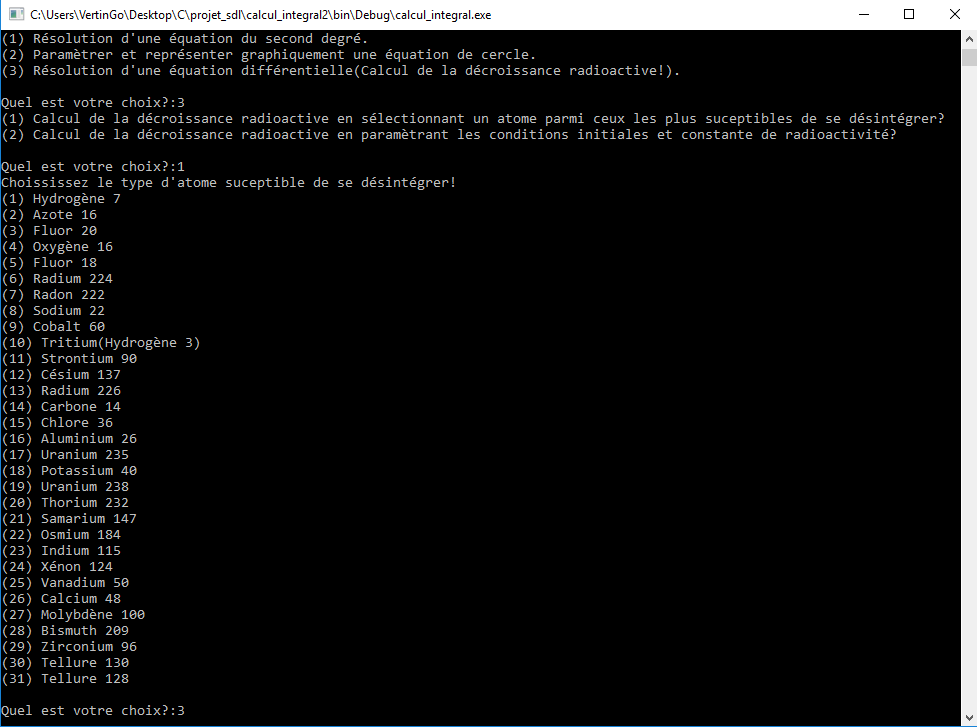</a>
  </td>
  </table>

  
   
  Calcul de la décroissance radioactive + représentation graphique de la courbe!
  
  <table>
  <td>
  
  </td>
  <td>
  
  </td>
  </table>

  <a href="https://raw.githubusercontent.com/vertingo/Calcul_Graphique_Integral/master/images/image_menu.png">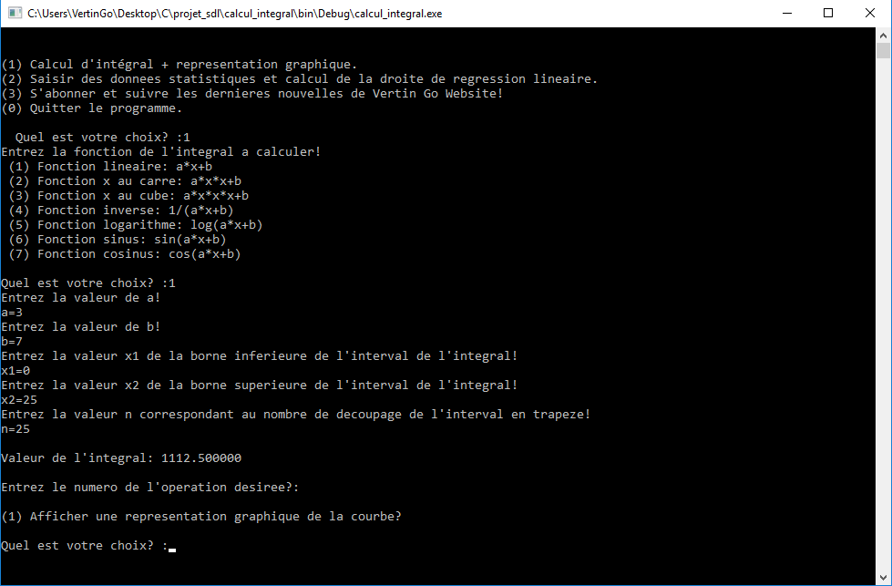</a>
  
Représentation graphique de la fonction x² sur [0,25] et [25,50] d'une fonction lineaire ax+b sur [0,25] et cos(x) sur [0,100]!

  <table>
  <td>
  <a href="https://raw.githubusercontent.com/vertingo/Calcul_Graphique_Integral/master/images/image_courbe.png">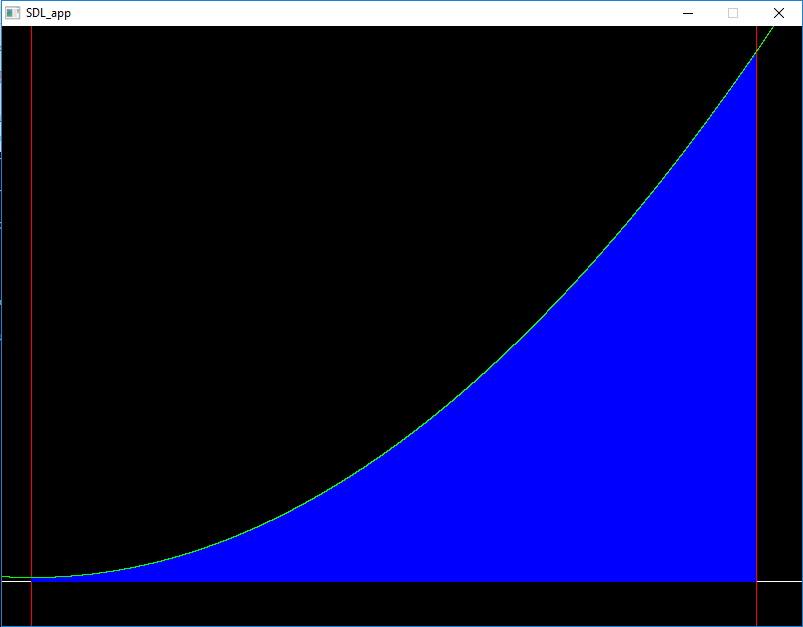</a>
  </td>
  <td>
  
  </td>
  <td>
  <a href="https://raw.githubusercontent.com/vertingo/Calcul_Graphique_Integral/master/images/image_courbe3.png">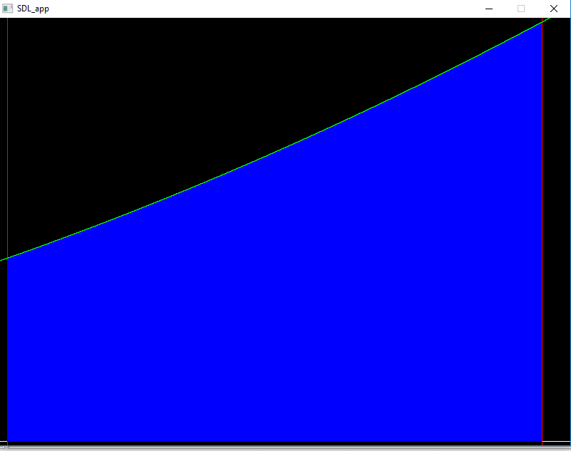</a>
  </td>
  <td>
  <a href="https://raw.githubusercontent.com/vertingo/Calcul_Graphique_Integral/master/images/image_courbe4.png">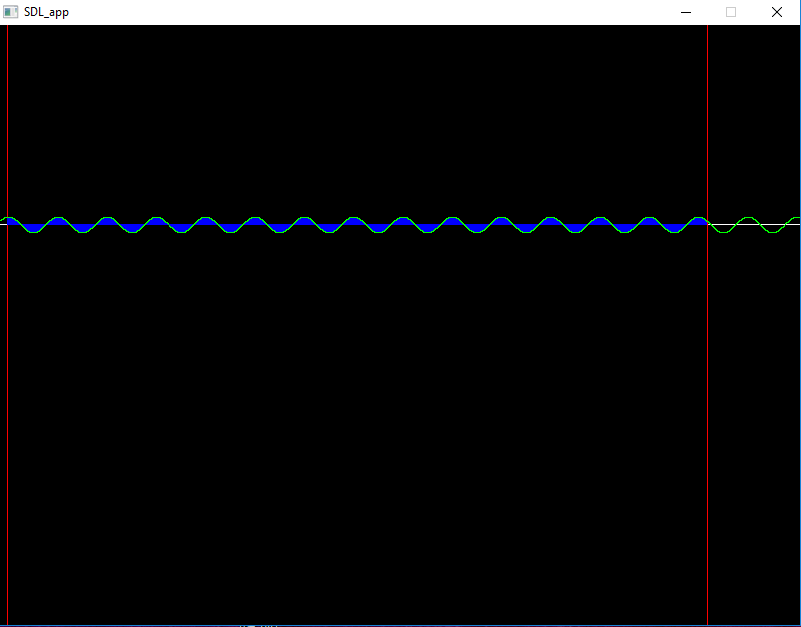</a>
  </td></table> 

  
  

