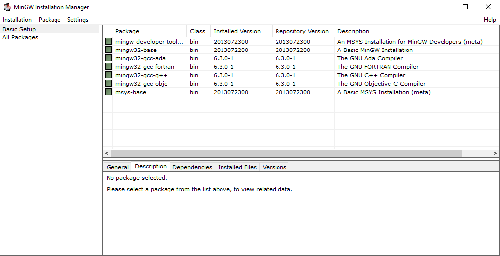
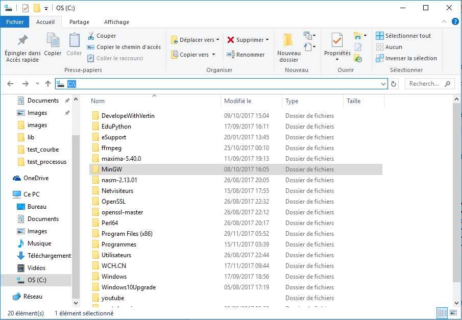
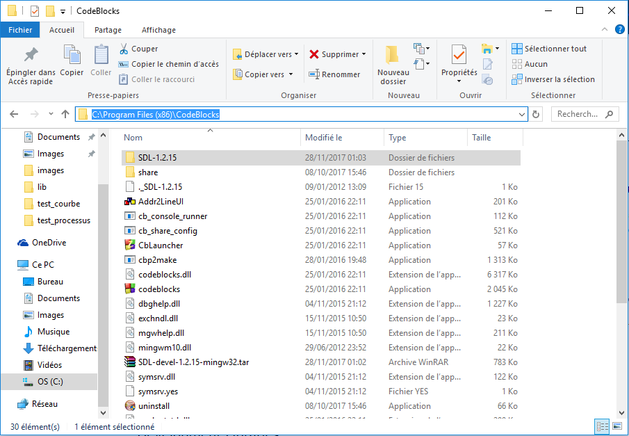
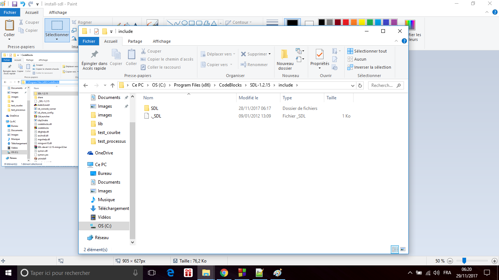
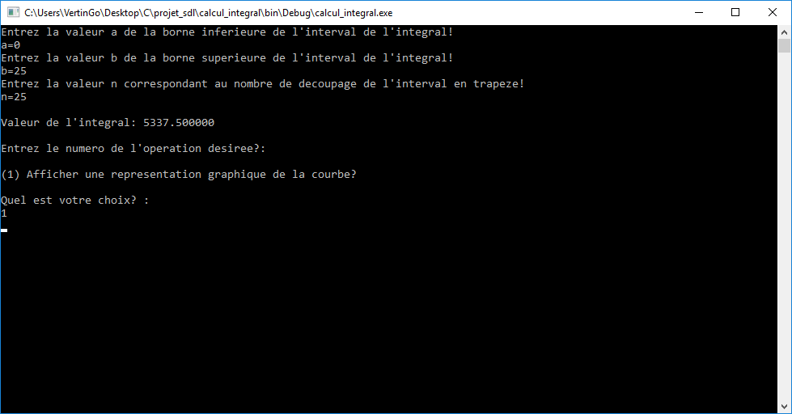

# Calcul d'intégral + plus représentation graphique

Un programme SDL(Nécessite l'installation de SDL pour être compilé et exécuté voir ci-dessous) en langage c 


## Prérequis
Téléchargement et installation du logiciel Code::Blocks disponible en téléchargement sur le lien suivant: http://www.commentcamarche.net/download/telecharger-34056352-code-blocks

1)Installation localement du compilateur MinGW disponible en téléchargement sur le lien suivant: https://sourceforge.net/projects/mingw-w64/

2) Cliquez sur install puis continue
3) Choisir mingw-developper-toolkit, mingw32-base, mingw32-gcc g++, msys-base comme sur
la capture ci-dessous:
<p align="center">
  <a href="https://www.youtube.com/channel/UC2g_-ipVjit6ZlACPWG4JvA?sub_confirmation=1"></a>
</p>
4) Puis dans le menu « Installation » cliquez sur « Apply changes »
5) Les packages sont alors téléchargés
6) Quittez
7) Exécutez « C:\MinGW\msys\1.0\postinstall », aux questions posées, répondre
a. y (yes)
b. y (yes)
c. Donnez le chemin d’installation de mingw, c’est-à-dire à la racine du disque c: c:\mingw
<p align="center">
  <a href="https://www.youtube.com/channel/UC2g_-ipVjit6ZlACPWG4JvA?sub_confirmation=1"></a>
</p>
d. validez avec la touche entrée


Installation de la bibliothèque SDL qui permet de créer des graphiques dans la console disponible sur le lien suivant: https://www.libsdl.org/
Ensuite en bas à droite accéder à l'onglet download!
Une fois téléchargé rendez-vous dans le dossier d'installation du logiciel Code::Blocks et suivez-les étapes illustrer ci-dessous!


<p align="center">
  <a href="https://www.youtube.com/channel/UC2g_-ipVjit6ZlACPWG4JvA?sub_confirmation=1"></a><br>
  Dézippé le contenu du dossier SDL à la racine du dossier du logiciel Code::Blocks<br>
  <a href="https://www.youtube.com/channel/UC2g_-ipVjit6ZlACPWG4JvA?sub_confirmation=1"></a><br>
  Assurez-vous bien que le dossier include contient bien le dossier SDL<br>
  <a href="https://www.youtube.com/channel/UC2g_-ipVjit6ZlACPWG4JvA?sub_confirmation=1"></a><br>

  <a href="https://www.youtube.com/channel/UC2g_-ipVjit6ZlACPWG4JvA?sub_confirmation=1"></a><br>
  Dans Code::Blocks faites file -> new project et choissisez un projet type SDL
  <br>
  <a href="https://www.youtube.com/channel/UC2g_-ipVjit6ZlACPWG4JvA?sub_confirmation=1"></a><br>
  <a href="https://www.youtube.com/channel/UC2g_-ipVjit6ZlACPWG4JvA?sub_confirmation=1"></a><br>
  Indiquez le chemin du dossier contenant le bibliothèque SDL normalement stocker à la racine du dossier contenant le logiciel Code::Blocks!<br>
  <a href="https://www.youtube.com/channel/UC2g_-ipVjit6ZlACPWG4JvA?sub_confirmation=1"></a><br>
</p>


## Usage
Grâce à ce calculateur d'intégral vous allez pouvoir calculer l'intégral de n'importe quelle courbe en spécifiant la valeur des borne inférieur et supérieur de l'intégral et également visualiser graphiquement l'air sous la courbe!
Voyez les illustrations ci-dessous!

<p align="center">
  <a href="https://www.youtube.com/channel/UC2g_-ipVjit6ZlACPWG4JvA?sub_confirmation=1"></a>
</p>

<p align="center">
  <a href="https://www.youtube.com/channel/UC2g_-ipVjit6ZlACPWG4JvA?sub_confirmation=1"></a>
  <a href="https://www.youtube.com/channel/UC2g_-ipVjit6ZlACPWG4JvA?sub_confirmation=1"></a>
  <a href="https://www.youtube.com/channel/UC2g_-ipVjit6ZlACPWG4JvA?sub_confirmation=1"></a>
</p>


## Details

```
Un petit coup de boost suivez-nous sur YouTube et Facebook!
[You Tube]: https://www.youtube.com/channel/UC2g_-ipVjit6ZlACPWG4JvA?sub_confirmation=1
[Facebook]: https://www.facebook.com/vertingo/
```

<p align="center">
  <a href="https://www.youtube.com/channel/UC2g_-ipVjit6ZlACPWG4JvA?sub_confirmation=1"></a>
  <a href="https://www.facebook.com/vertingo/"></a>
</p>
